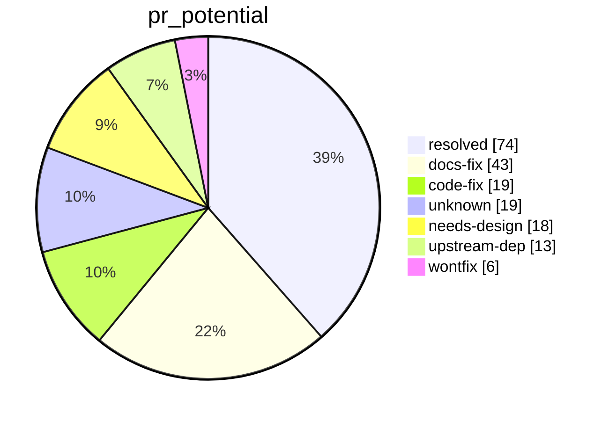

# input-remapper: FOSS Insights

An evidence-backed, versioned map of the problems reported against sezanzeb/input-remapper, and a queue of pull requests that could close them.

| Corpus | Count |
|---|---|
| Issues and PRs | 1099 (259 are PRs) |
| Analysed so far | 192 (see [coverage](coverage.md)) |
| Tags applied | 1662 |
| Recurring problems registered | 5 (see [problems](problems.md)) |

## pr_potential

## By cause

| cause | Items |
|---|---|
| [missing-feature](by/cause/missing-feature.md) | 57 |
| [doc-gap](by/cause/doc-gap.md) | 37 |
| [distro-compat](by/cause/distro-compat.md) | 33 |
| [device-quirk](by/cause/device-quirk.md) | 23 |
| [de-compat](by/cause/de-compat.md) | 21 |
| [permission](by/cause/permission.md) | 12 |
| [wayland-issue](by/cause/wayland-issue.md) | 12 |
| [x11-issue](by/cause/x11-issue.md) | 12 |
| [autoload-failure](by/cause/autoload-failure.md) | 9 |
| [macro-logic](by/cause/macro-logic.md) | 7 |
| [symbol-mapping](by/cause/symbol-mapping.md) | 6 |
| [config-error](by/cause/config-error.md) | 5 |
| [evdev-api](by/cause/evdev-api.md) | 4 |
| [python-version](by/cause/python-version.md) | 4 |
| [ui-logic](by/cause/ui-logic.md) | 4 |
| [race-condition](by/cause/race-condition.md) | 3 |
| [unknown](by/cause/unknown.md) | 3 |
| [regression](by/cause/regression.md) | 2 |
| [combination-logic](by/cause/combination-logic.md) | 1 |
| [uinput-api](by/cause/uinput-api.md) | 1 |

## By kind

| kind | Items |
|---|---|
| [bug](by/kind/bug.md) | 87 |
| [feature-request](by/kind/feature-request.md) | 50 |
| [question](by/kind/question.md) | 35 |
| [meta](by/kind/meta.md) | 14 |
| [support](by/kind/support.md) | 5 |
| [spam](by/kind/spam.md) | 1 |

## By layer

| layer | Items |
|---|---|
| [injector](by/layer/injector.md) | 33 |
| [install](by/layer/install.md) | 33 |
| [macro](by/layer/macro.md) | 31 |
| [daemon](by/layer/daemon.md) | 27 |
| [mapping](by/layer/mapping.md) | 27 |
| [device](by/layer/device.md) | 20 |
| [gui](by/layer/gui.md) | 19 |
| [reader](by/layer/reader.md) | 18 |
| [permissions](by/layer/permissions.md) | 9 |
| [config](by/layer/config.md) | 8 |
| [combination](by/layer/combination.md) | 5 |
| [docs](by/layer/docs.md) | 1 |

## By pr_potential

| pr_potential | Items |
|---|---|
| [resolved](by/pr_potential/resolved.md) | 74 |
| [docs-fix](by/pr_potential/docs-fix.md) | 43 |
| [code-fix](by/pr_potential/code-fix.md) | 19 |
| [unknown](by/pr_potential/unknown.md) | 19 |
| [needs-design](by/pr_potential/needs-design.md) | 18 |
| [upstream-dep](by/pr_potential/upstream-dep.md) | 13 |
| [wontfix](by/pr_potential/wontfix.md) | 6 |

Also: [triage queue](triage.md), [provenance](provenance.md).
