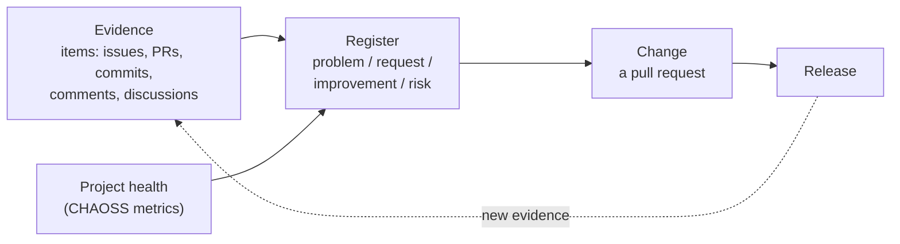

# Methodology: what FOSS Insights takes from ITIL 4 and from software standards

ITIL 4 is a framework for running IT *services*; it has no notion of a free-software project (no customers with SLAs, no service desk). Software engineering has
its own standards for the same questions. FOSS Insights takes the parts of each that fit a public project history and leaves the rest. Sources were read on 2026-09-20; links at the end.

## The structure, in one picture

## What was taken, and where it lives

| Idea | Source | In FOSS Insights |
|---|---|---|
| Keep *incidents* (something broke for someone) apart from *problems* (the root cause behind many incidents) and from *changes* | ITIL 4 incident, problem and change practices | items are evidence; the register holds the problems; a change is a PR |
| **Known error**: a problem with a documented workaround and no fix yet | ITIL 4 problem management | register status `known-error`, and the batch is refused without a `workaround` |
| One **continual improvement register**, prioritised, holding ideas of every kind | ITIL 4 continual improvement | the `register` table; entry types `problem`, `request`, `improvement`, `risk`; coarse `value`, `effort`, `risk` tags |
| **Four dimensions** of any service: organisations and people, information and technology, partners and suppliers, value streams and processes | ITIL 4 | facet `dimension`: `people`, `information-technology`, `partners`, `processes` |
| Guiding principles: start where you are; progress iteratively with feedback; focus on value; keep it simple and practical; collaborate and promote visibility; think and work holistically; optimise and automate | ITIL 4 | already the [principles](principles.md): read what exists first, rounds with a checkpoint each, evidence on every claim, generated pages, one tool |
| Classify every **modification request**, then group: corrective, adaptive, perfective, preventive, additive; reactive (corrective, adaptive) versus proactive (the rest) | ISO/IEC/IEEE 14764:2022, SWEBOK | facet `change_type` |
| Work that is only corrective and adaptive lets the structure of the software decay; **preventive** maintenance (restructuring, refactoring) is what counters it | ISO/IEC/IEEE 14764 | refactoring and testability entries are first-class register entries with `change_type: preventive` |
| Nine product-quality characteristics: functional suitability, performance efficiency, compatibility, interaction capability, reliability, security, maintainability, flexibility, safety | ISO/IEC 25010:2023 | facet `quality` |
| Project health: time to first response, change request closure ratio, contributor absence factor (formerly bus factor), release frequency | CHAOSS starter project-health model | the generated `health.md` page |

## What was left out, and why

- **Service catalogue, SLAs, service desk, change advisory board.** There is no provider, contract or approval body in a public project. The function of change enablement (do not break users)
  is served by three things that exist here: the `change_type`, the `risk` tag, and the rule that an entry needs evidence before it becomes a pull request.
- **Numeric scores (RICE, WSJF).** They need reach and cost data we do not have; they would give false precision. `value`, `effort` and `risk` stay three-level on purpose.
- **Technical-debt quantification (SQALE and similar).** Needs static analysis of the code; out of scope for a history-based method. Debt is recorded as a `preventive` improvement with evidence.
- **The full software life-cycle (ISO/IEC/IEEE 12207).** Only the maintenance process is relevant to an existing project.

## Limits worth stating

- A health metric cannot tell a busy maintainer from a departed one; a contributor absence factor of 1 means the same for both. Read the numbers with what the maintainer has *said* (an evidence item), not instead of it.
- Bot accounts distort responsiveness metrics, so they are excluded from every response number here.
- The register's `value` and `effort` are an analyst's judgement (`conf:inferred`) until a maintainer says otherwise.
- Health pages show aggregates only, in line with CHAOSS's own data-ethics warning about person-level metrics.

## Sources

- ITIL 4 practices and Service Value System: https://itsm.tools/34-itil-4-management-practices/ and https://itsm.tools/the-itil-4-service-value-system-explained/
- ISO/IEC/IEEE 14764:2022 (maintenance types, modification requests): https://standards.iteh.ai/catalog/standards/iso/70aa2449-ac83-46d7-84c2-fe73a5a2efcc/iso-iec-ieee-14764-2022
- ISO/IEC 25010:2023 (nine characteristics; safety added, usability and portability renamed): https://cdn.standards.iteh.ai/samples/78176/13ff8ea97048443f99318920757df124/ISO-IEC-25010-2023.pdf
- CHAOSS starter project-health model: https://chaoss.community/kb/metrics-model-starter-project-health/ and contributor absence factor: https://www.chaoss.community/kb/metric-contributor-absence-factor/
- A critique of what these metrics cannot see: https://nesbitt.io/2026/05/27/chaoss-metrics-in-2026.html
